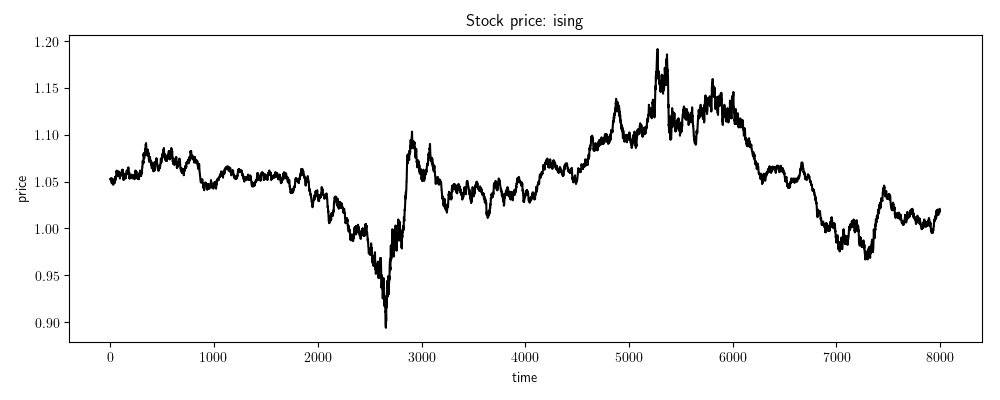

## Spin Model of Market

* PHYS4061 Project B: Monte Carlo Simulation
* Last update: 16/12/2019

## Central Question

* from a statistical perspective, is the market spin model an accurate description of market?

## Features

* setting: a market of interacting traders
* traders are placed on a 2D lattice with periodic boundary (2D Ising model)
* spin (+/-) corresponds to traders' buy/sell decision
* spins _locally_ seeking ferromagnetic order (interaction with nbor)
	- meaning: individual traders imitating their nbor (herding)
* spins _globally_ escaping ferromagnetic order (external field)
	- meaning: traders attempting to be in minority (avoiding)
* returns & stock prices updated by net magnetisation
* outputs, like returns and prices, are then passed to python codes
* snaphots taken per 1000 time steps (black & white as opposite spins):

	

* simulated stock price:

	

* see report for the technicality

## Codes

* folders:
	- `demo/`: spin animation and price plot from spin model
	- `out/`: data outputs (where raw data files go to)
	- `plt/`: python plots (where plots go to)
	- `res/`: categorised results (for report)
	- `versions/`: different extentions of spin model

* files:
	- `main.c`: the base model (also in `versions/`)
	- `tool.c`: small helper library
	- `vector.c`: small vector library
	- `plot_stock.py`: generate plots and analysis from `data.csv`
	- `spin.py`: generate spin animation from `spin.csv`
	- `run.sh`: compile and run `main.c`

* outputs:
	- `data.csv`: price, magnetisation, return from spin model (time series data)
	- `spin.csv`: spins on lattice (optional)

## Extentions

* The base model
	- `main-1-base.c`
* Poisson lag
	- `main-2-poi-lag.c`
* Magnetisation-dependent lag
	- `main-3-mag-lag.c`
* Many neighbor but weak couplings
	- `ext-1-many-nbor.c`
* Decaying couplings with homogeneous traders
	- `ext-2-decay-J.c`
* Random couplings with homogeneous trader
	- `ext-3-rand-J-homo.c`
* Random couplings with heterogeneous traders (two types)
	- `ext-4-rand-J-hetero.c`
* Random walk model
	- `rwm.c`
* see `versions/` folder

## Params

* definitions are documented at the beginning of each model
* for each model, params are largely identical, except for certain modifications

## Results

* plots:
	- stock price as time series
	- return as time series
	- distribution of return
	- quantile plot of return
	- autocorrelation of return & absolute return
* statistics:
	- skewness & kurtosis
	- power-law exponent
* generated by `plot_stock.py`
* see report for detailed analysis

## References

* Dynamics of price and trading volume in a spin model of stock markets with heterogeneous agents (Bornholdt)
